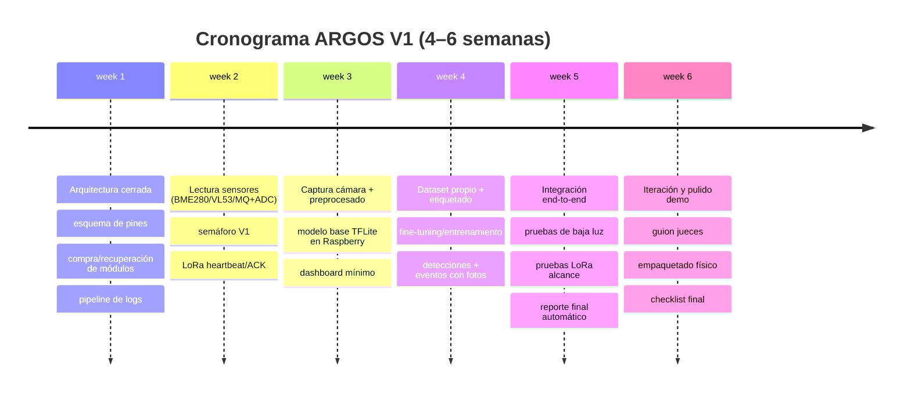

# ARGOS: sistema integral de reconocimiento y seguridad en cuevas

## Resumen ejecutivo y objetivo

ARGOS es un sistema integral (V1) de **reconocimiento y seguridad en entornos espeleológicos** que combina: (a) sensórica ambiental (temperatura y calidad de aire como indicador de ventilación), (b) detección de obstáculos por distancia, (c) visión computacional para identificar clases clave y priorizar “anomalías”, y (d) telemetría robusta mediante LoRa como canal crítico, con Wi‑Fi como canal opcional para sincronizar evidencias (fotos y reportes) cuando exista conectividad. El núcleo de cómputo se basa en una Raspberry Pi 5 y se apoya en interfaces estándar (I2C, SPI y GPIO) para minimizar costo, complejidad y tiempos de integración. citeturn16view0turn15view1turn12view0turn16view4turn16view5

El valor diferencial de ARGOS no es “ver una cueva”, sino **operacionalizar un protocolo de mitigación de riesgos**: antes de ingresar, durante la exploración y al finalizar, con evidencias trazables (logs, eventos y capturas). Esta posición es clave porque, en espacios confinados, la atmósfera puede ser peligrosa por **deficiencia de oxígeno** y/o acumulación de gases como CO₂; en normativa de seguridad laboral, se considera atmósfera deficiente de oxígeno por debajo de **19,5% O₂**. citeturn15view2

**Objetivo general (V1):** construir un prototipo demostrable (educativo/competitivo) que:
- emita un **semáforo GO / AMARILLO / ROJO** basado en sensórica ambiental y reglas de riesgo,
- detecte **obstáculos** a corta distancia,
- identifique **8 clases** (casco, linterna, cuerda, persona, mochila, señal, roca común, anomalía),
- transmita telemetría en tiempo real por LoRa y genere un **reporte final** con métricas y fotos.

**Nota crítica de alcance (seguridad):** ARGOS V1 **no sustituye** instrumentación profesional ni protocolos reales de espeleología/rescate; es un sistema de apoyo educativo y de demostración. En contextos reales, equipos y personal capacitado deben aplicar procedimientos de evaluación atmosférica y entrada a espacios confinados. citeturn15view2turn6search5

---

## Descripción teórica y criterios de éxito

### Problema

Las cuevas y espacios confinados presentan riesgos recurrentes que degradan la seguridad y la eficiencia de la exploración: baja visibilidad, obstáculos inesperados, pérdida de orientación y, especialmente, **riesgo atmosférico** (por ejemplo, condiciones compatibles con atmósfera peligrosa/deficiente). citeturn15view2turn6search2turn6search6

Desde un marco de seguridad laboral, un espacio confinando de riesgo exige identificar posibles atmósferas peligrosas; la definición de atmósfera deficiente de oxígeno (<19,5%) es un umbral estándar en seguridad ocupacional. citeturn15view2turn6search3

### Hipótesis de diseño

Si se integra (1) sensórica ambiental de bajo costo para estimar condiciones y tendencias, (2) detección de obstáculos por distancia, (3) visión computacional ligera para etiquetar elementos relevantes y priorizar anomalías, y (4) una telemetría robusta (LoRa) con registro local, entonces se puede **reducir el riesgo operacional** (alertas y “NO‑GO” oportunos) y **mejorar la eficiencia investigativa** (triage automático de hallazgos), manteniendo un prototipo viable en 4–6 semanas.

### Métricas de éxito

Para que ARGOS V1 sea defendible ante jueces y externos, conviene definir métricas medibles desde el primer día:

- **Seguridad ambiental (consistencia):** estabilidad de lecturas (desviación), tiempo de respuesta y tasa de falsos ROJO/VERDE.
- **Obstáculos:** porcentaje de detección a distancia umbral, latencia de alerta y tasa de falsos positivos.
- **Visión IA:** precisión/recobrado por clase (o mAP si se usa detector), tasa de “anomalías” relevantes, y FPS/latencia en Raspberry.
- **Comunicaciones LoRa:** alcance útil en el recinto de pruebas, tasa de pérdida, porcentaje de entrega de alertas críticas y consumo.
- **Experiencia de demostración:** tiempo para comprender el sistema (30 s) y evidencia generada (reporte con fotos y eventos).

### Limitaciones y supuestos V1

- **MQ‑135** no mide oxígeno; se usa como **indicador semiconductivo de “calidad de aire”** (variación de Rs/R0) bajo condiciones y calibración específicas, y requiere un tiempo de precalentamiento prolongado (>48 horas en condiciones estándar). citeturn16view5turn9view2  
- La evaluación atmosférica real para entrada segura suele requerir sensores dedicados (p. ej., electroquímicos para O₂). Como alternativa opcional y más “real” existe un sensor electroquímico I2C con rango típico 0–25% vol, pero con mayor coste. citeturn1search1turn1search5  
- El SLAM visual en cuevas (baja luz y baja textura) es frágil; por ello V1 prioriza **checkpoints + evidencias**, y deja SLAM completo como evolución. La literatura reporta fallos y degradación en escenarios de baja textura/iluminación para enfoques visuales tradicionales. citeturn2search1turn2search5turn2search16

---

## Arquitectura electrónica y materiales

### Lista de hardware V1 y alternativas económicas

En V1 se recomienda una arquitectura que separe claramente: **cómputo**, **sensado**, **actuación**, **comunicaciones** y **potencia**. Raspberry Pi 5 aporta CPU y puertos; su alimentación objetivo es 5V/5A por USB‑C con soporte de Power Delivery. citeturn16view0turn3view0

image_group{"layout":"carousel","aspect_ratio":"1:1","query":["Raspberry Pi 5 board","BME280 breakout module","MQ-135 gas sensor module","VL53L0X time-of-flight sensor breakout","SX1278 LoRa 433MHz module SPI","DRV8833 motor driver module"],"num_per_query":1}

#### Tabla de materiales y referencias (fuentes oficiales y alternativas)

| Subsistema | Elemento | Función en ARGOS | Recomendación V1 | Alternativas económicas / notes | Fuentes |
|---|---|---|---|---|---|
| Cómputo | Raspberry Pi 5 | Procesa sensores, IA y LoRa | Modelo 4GB/8GB según disponibilidad; requiere buen suministro | Raspberry Pi 4 puede funcionar como fallback con menor margen de IA | Product brief Raspberry Pi 5. citeturn16view0 |
| Cámara | Webcam USB o cámara CSI | Flujo de vídeo para IA; evidencia (fotos) | Webcam USB UVC (plug&play) o cámara oficial (si existe) | Para baja luz: cámara NoIR + iluminación IR (si se dispone) | Software cámara/libcamera. citeturn5search3turn5search7 |
| Mapeo externo | iPhone | Evidencia de malla/escena (si LiDAR) | Usar ARKit/RealityKit para reconstrucción cuando el dispositivo tenga LiDAR | Si no hay LiDAR, usar solo vídeo/fotos + checkpoints | ARKit scene reconstruction. citeturn2search0turn2search9turn2search6 |
| Motores | 4 motores DC | Movilidad del “rover”/plataforma | Motores DC con reductora (bajo consumo), 4× | En demo, se puede simular movimiento sin desplazamiento real (giro sobre base) | (Selección depende de torque y batería; ver drivers) |
| Driver motores | Drivers H‑Bridge | Control de 4 motores con PWM | 2× DRV8833 (cada uno maneja 2 motores) | 2× TB6612FNG (mejor eficiencia que L298N típico); L298N es robusto pero suele ser menos eficiente | Datasheets DRV8833 / TB6612 / L298. citeturn5search2turn1search11turn5search1 |
| Sensor ambiental | BME280 | Temperatura (y opcional: humedad/presión) | Un módulo BME280 por I2C | Múltiples BME280 en bus I2C (si cambian direcciones) | Datasheet BME280. citeturn16view2turn16view3 |
| Sensor aire | MQ‑135 | Indicador de “aire deteriorado” (proxy) | 1× MQ‑135 + ADC externo | Mejor (más “real”): sensor CO₂ I2C (SCD4x/SCD3x) o sensor O₂ electroquímico; incrementa coste | Manual MQ‑135, preheat y condiciones. citeturn16view5turn9view2turn1search1 |
| ADC | MCP3008 o similar | Lectura analógica del MQ‑135 en Raspberry | MCP3008 por SPI (8 canales, 10‑bit) | Alternativa: ADS1115 (I2C, 16‑bit) si se prioriza resolución | Datasheet MCP3008 (Microchip/Adafruit). citeturn7search6turn7search18 |
| Distancia | VL53L0X | Detección de obstáculos (ToF) | 1× VL53L0X por I2C | Ultrasonido HC‑SR04 (más barato, peor en geometrías complejas y requiere 5V) | Datasheet VL53L0X (I2C 400 kbps, addr). citeturn16view4turn8view1 |
| LoRa | Módulo 433 MHz (SPI) | Canal crítico de telemetría | Módulo SX1278‑based (SPI) con antena 433 MHz | Alternativa: módulo “transparente” UART (más simple) si se consigue; revisar normativa | LoRa1278 features/pines. citeturn12view0turn16view7turn16view6 |
| Iluminación | Linterna/LED | Mejora IA y seguridad visual | Linterna LED frontal o LED fijo al chasis | Añadir difusor; alimentar desde rail de motores o buck dedicado | (Recomendación de ingeniería; depende de montaje) |
| Potencia | Batería + regulación | 5V estable para Pi + rail motores | Powerbank USB‑C PD para Pi; batería separada para motores | Buck converter dedicado para 5V si se usa batería única; siempre masa común | Requisito 5V/5A Pi 5. citeturn16view0turn3view0 |
| Cableado | Cables, conectores | Robustez mecánica | Dupont/ JST‑XH/ borneras según vibra | Usar termo-retráctil y fijación mecánica | (Buenas prácticas) |

### Recomendación “drivers de motor” para 4 motores

Para una plataforma con 4 motores DC, V1 necesita **dos canales duales** o un controlador 4‑canal. Dos opciones razonables:

- **2× DRV8833:** rango de alimentación del driver 2,7 a 10,8 V y corriente hasta 1,5 A RMS, con interfaz PWM simple. citeturn5search2  
- **2× TB6612FNG:** típico 1,2 A continuos (pico superior) y lógica compatible con 3,3 V; motor y lógica separables, beneficioso en Raspberry. citeturn1search11turn1search7  

El L298 puede funcionar y es común, pero su tecnología y pérdidas suelen penalizar autonomía/torque efectivo; se reserva como alternativa cuando ya se dispone físicamente del módulo o se prioriza robustez y disponibilidad local. citeturn5search1turn5search15

### Diagrama de conexiones y asignación de pines

#### Interfaces clave de la Raspberry (referencia V1)
La documentación de hardware de Raspberry Pi describe pines típicos para SPI0, I2C y UART, y recalca que los GPIO son de **3,3 V**. citeturn15view1

**Propuesta de asignación (bus compartido y chip‑select):**
- I2C: BME280 + VL53L0X (bus compartido SDA/SCL).
- SPI0: MCP3008 (ADC) + LoRa (SX1278) en el mismo bus, separados por chip select.
- GPIO/PWM: drivers de motor (pines PWM + dirección).
- Alimentación: 3,3 V para lógica/sensores digitales (si los módulos lo permiten), 5 V para periféricos (según módulo), motor rail separado.

#### Tabla de conexiones recomendadas (V1)

| Módulo | Interfaz | Pines Raspberry sugeridos (BCM) | Notas críticas |
|---|---|---|---|
| BME280 | I2C | GPIO2 (SDA), GPIO3 (SCL) | Dirección 0x76 u 0x77 según SDO; no dejar SDO flotante. citeturn10view0turn15view1 |
| VL53L0X | I2C | GPIO2 (SDA), GPIO3 (SCL) | I2C hasta 400 kbps; dirección por defecto 0x52 (8‑bit), equivalente habitual 0x29 (7‑bit). citeturn16view4turn15view1 |
| MCP3008 (ADC) | SPI0 | MOSI GPIO10, MISO GPIO9, SCLK GPIO11, CS GPIO8 (CE0) | Raspberry no tiene ADC interno: imprescindible si MQ‑135 es analógico. citeturn15view1turn7search6 |
| LoRa SX1278 (módulo SPI) | SPI0 + GPIO | MOSI GPIO10, MISO GPIO9, SCLK GPIO11, CS GPIO7 (CE1) + RESET GPIO24 + DIO0 GPIO25 | Pines SPI del SX127x y líneas DIO/RESET están definidos por datasheet; en módulos, revisar pinout. citeturn16view6turn16view7turn15view1 |
| MQ‑135 | Analógico → ADC | MQ‑135 OUT → MCP3008 CH0 | Precalentar >48h; consume por calefactor; presencia de O₂ a 21% en condiciones estándar de prueba. citeturn16view5turn9view2 |
| Driver motores (2× DRV8833 o TB6612) | GPIO + PWM | PWM: GPIO12/13/18/19 (recomendado) + pines de dirección (ej. GPIO5/6/16/20/21/26) | PWM hardware disponible en GPIO12/13/18/19. citeturn15view1 |
| Linterna/LED | Alimentación | Rail 5V o rail motores con buck | Evitar alimentar LEDs potentes desde 3,3V. |
| Alimentación Pi | USB‑C | 5V/5A | Requisito formal en el product brief. citeturn16view0 |

**Regla de oro eléctrica:** aunque haya dos baterías (Pi y motores), deben compartir **GND común** para que señales PWM/GPIO tengan referencia consistente (buenas prácticas de electrónica de potencia).

### Consideración de normativa (433 MHz)

El uso de 433 MHz en LoRa suele asociarse a radiocomunicaciones de corto alcance/baja potencia; en Colombia existen marcos regulatorios de “uso libre”/baja potencia que han evolucionado en el tiempo. En V1 conviene documentar explícitamente: potencia configurada, tipo de antena y verificación de conformidad del equipo en el país del evento. citeturn4search6turn4search10

---

## Arquitectura software y flujo de datos

### Stack recomendado (V1)

- Sistema operativo: Raspberry Pi OS (Debian‑based, recomendado por la documentación oficial). citeturn15view0  
- Lenguaje: Python 3.
- Cámara: `libcamera`/herramientas de Raspberry para captura y tuning. citeturn5search3  
- IA: TensorFlow Lite (runtime ligero) y `tf.lite.Interpreter` para inferencia embebida. citeturn4search1turn4search5turn2search14  

En Raspberry Pi, TensorFlow Lite suele ejecutarse con menor carga que TensorFlow completo, y hay guías prácticas específicas para Pi 4/5. citeturn2search14turn2search10

### Estructura de módulos (Python) y responsabilidades

Se recomienda un repositorio con módulos cohesionados, orientados a pruebas unitarias por subsistema:

- `sensors/`  
  Lectura BME280 (I2C), VL53L0X (I2C), MQ‑135 (vía ADC), filtros (promedios móviles).  
  Referencias de modos/parametrización BME280 (sleep/normal/forced) y direcciones I2C. citeturn16view2turn10view0

- `vision/`  
  Captura frames, preprocesado (resize/normalización), inferencia TFLite, postprocesado (NMS si aplica), extracción de eventos (detección, anomalía).

- `decision/`  
  Motor de reglas (semáforo GO/AMARILLO/ROJO), umbrales de distancia, lógica de “alarma crítica”.

- `comms/`  
  Driver LoRa (SPI) + protocolos (ack/seq), gestión Wi‑Fi opcional para sincronizado.

- `logging/`  
  NDJSON de eventos, CSV de telemetría agregada, carpeta de evidencias (fotos etiquetadas), reporte final.

### Formato de mensajes LoRa y frecuencia de muestreo

LoRa tiene tasas de datos efectivas bajas (especialmente en SF altos) y payloads que conviene mantener compactos. Un módulo SX1278‑based reporta rango de tasa LoRa en el orden de 0,018–37,5 kbps y motor de paquetes hasta 256 bytes con CRC (según la implementación del módulo), lo que guía el diseño hacia mensajes cortos y event‑driven. citeturn12view0

#### Tabla de muestreo y telemetría (V1)

| Señal | Frecuencia sugerida | Motivo | Se transmite por LoRa |
|---|---:|---|---|
| Temperatura (BME280) | 1 Hz | Tendencias lentas | Sí (agregado/último valor) |
| Humedad (opcional BME280) | 0,5–1 Hz | Tendencias lentas | Opcional |
| Índice MQ‑135 (Rs/R0) | 1 Hz | Tendencia de “aire deteriorado” | Sí (normalizado) |
| Distancia VL53L0X | 10 Hz | Obstáculo requiere reacción rápida | Sí (solo si cruza umbral o agregado cada 1 s) |
| Detección IA | 5–15 FPS (interno) | Depende de rendimiento | Sí (eventos, no streaming) |
| “Heartbeat” del sistema | 1 cada 2–5 s | Estado + sincronización | Sí |

#### Ejemplos de paquetes LoRa (JSON compacto)

> Recomendación práctica: usar claves cortas, enteros y escalados para ahorrar bytes.

**Heartbeat (≈ 40–70 bytes):**
```json
{"t":1700000000,"st":"G","tmp":241,"aq":73,"bat":86,"seq":1042}
```

**Evento obstáculo (≈ 40–80 bytes):**
```json
{"t":1700000012,"ev":"OBS","d":18,"st":"Y","seq":1043}
```

**Evento IA (≈ 60–120 bytes, según clase):**
```json
{"t":1700000030,"ev":"DET","c":"ANOM","p":82,"img":"A104.jpg","seq":1047}
```

**Convenciones:**
- `tmp` = temperatura ×10 (241 = 24,1°C)  
- `aq` = índice MQ‑135 normalizado 0–100 (no ppm real)  
- `st` = G/Y/R (GO/AMARILLO/ROJO)  
- `seq` = número de secuencia para reordenar y detectar pérdidas

### Manejo de pérdidas y gateway

Un ejemplo de módulo LoRa documenta un modo “Master/Slave” con envío periódico (p. ej., 1 paquete por segundo) y espera de ack; esta lógica es replicable en Python para robustez (ACK + reintentos + ventana). citeturn12view0

**Arquitectura recomendada:**
- **Nodo “caverna” (Raspberry + sensores):** envía LoRa.
- **Gateway “superficie” (laptop o segunda Raspberry):** recibe LoRa (SPI/UART) y expone la UI.

### Visualización en laptop y modo PWA (offline)

Para una demo sólida, la laptop abre una web local (`http://localhost`) que muestra semáforo, telemetría y eventos. Puede hacerse instalable/offline como PWA mediante manifiesto y service worker, con documentación clara en español. citeturn5search0turn5search4turn5search11turn5search8

---

### Diagrama de bloques del flujo de datos (mermaid)

```mermaid
flowchart LR
  subgraph SENSORES
    BME[BME280: temp/hum/pres]
    MQ[MQ-135: salida analógica]
    ADC[MCP3008: ADC SPI]
    TOF[VL53L0X: distancia I2C]
    CAM[Cámara: frames]
  end

  subgraph RPI[Raspberry Pi: adquisición + IA + decisiones]
    PRE[Preprocesado y filtros]
    INF[Inferencia IA (TFLite)]
    RULES[Reglas de riesgo + semáforo]
    EVT[Generador de eventos]
    LOG[Logs + fotos + reporte]
  end

  subgraph COMMS[Comunicaciones]
    LORA[LoRa 433: telemetría crítica]
    WIFI[Wi‑Fi: sincronización opcional]
  end

  subgraph UI[Gateway / Laptop]
    DASH[Dashboard (web/PWA)]
    REP[Reporte final]
  end

  MQ --> ADC --> PRE
  BME --> PRE
  TOF --> PRE
  CAM --> PRE --> INF --> EVT
  PRE --> RULES --> EVT
  EVT --> LOG
  EVT --> LORA --> DASH
  LOG --> WIFI --> REP
  WIFI --> DASH
```

---

## Flujo end‑to‑end y motor de decisiones

### Adquisición → preprocesado → inferencia → eventos

1) **Adquisición:**  
   BME280 y VL53L0X llegan por I2C; MQ‑135 llega como analógico y se digitaliza por MCP3008 (SPI). La cámara entra por `libcamera` o UVC según hardware. citeturn15view1turn16view2turn16view4turn7search6turn5search3

2) **Preprocesado:**  
   - Promedio móvil y detección de outliers en sensores.
   - Normalización del “índice aire” (MQ‑135) en escala 0–100 basada en baseline.
   - Ajuste de imagen: resize (p. ej., 320×320), normalización, control de exposición si es posible (tuning).

3) **Inferencia IA (TFLite):**  
   Ejecutar un detector ligero (familia MobileNet/YOLO‑tiny/Efficient‑lite). Para V1, lo clave no es el “modelo perfecto” sino una inferencia estable y medible. La interfaz `tf.lite.Interpreter` es el componente estándar para ejecutar modelos TFLite. citeturn4search1turn2search7turn2search14

4) **Reglas de riesgo (semáforo):**  
   - Si distancia < umbral crítico → evento `OBS` y estado AMARILLO/ROJO según severidad.  
   - Si “aire” sube por encima de baseline + umbral → AMARILLO; si persiste + supera umbral alto → ROJO.  
   - Si IA detecta “persona/casco/cuerda” → evento operativo; si detecta “anomalía” → foto + evento prioritario.

5) **Telemetría LoRa:**  
   - Heartbeat cada 2–5 s con estado y valores agregados.
   - Eventos críticos en el instante (obstáculo, ROJO, anomalía).  
   - Ack/reintentos con `seq` para robustez. citeturn12view0turn16view6

6) **Sincronización Wi‑Fi:**  
   Al recuperar conectividad, subir `events.ndjson`, reporte `.json` y fotos. El dashboard puede cachear para modo “evento con mala señal” usando service worker. citeturn5search4turn5search0

---

## Plan de integración IA y dataset

### Clases objetivo (V1)

- Casco
- Linterna (frontal o mano)
- Cuerda
- Persona
- Mochila
- Señal/marker (cinta, etiqueta, cono)
- Roca común
- Anomalía (superficie brillante/unusual/forma no natural)

### Estrategia de dataset (mínimo viable)

Para que el modelo sea entrenable en 4–6 semanas con recursos limitados, el dataset debe ser **pequeño, consistente y con variabilidad controlada** (ángulos, distancias, condiciones de luz).

#### Tabla de tamaño mínimo recomendado (heurístico V1)

| Clase | Objetivo de imágenes anotadas (mínimo) | Variabilidad obligatoria |
|---|---:|---|
| Persona | 200–400 | luz baja/media, postura, distancia |
| Casco | 200–300 | sobre persona y aislado |
| Linterna | 150–250 | encendida/apagada, diferentes ángulos |
| Cuerda | 150–250 | enrollada/extendida, en suelo/pared |
| Mochila | 150–250 | diferentes colores/volúmenes |
| Señal | 150–250 | distintos markers (cinta/etiqueta) |
| Roca común | 200–400 | texturas típicas, tamaños |
| Anomalía | 150–300 | “brillos”, vetas, objetos “raros” controlados |

**Recomendación práctica:** si el tiempo aprieta, priorizar 5 clases (persona, casco, cuerda, señal, anomalía) y añadir el resto con aprendizaje incremental.

### Etiquetado y formato

- Anotar con bounding boxes (COCO JSON o Pascal VOC) para detección.
- Separar en `train/val/test` (p. ej. 70/20/10) y controlar que no haya “fugas” (mismo escenario en train y test).

### Entrenamiento y conversión a TFLite

Ruta recomendada (realista):
- Entrenar en laptop o en notebooks (por ejemplo, flujos basados en SSD‑MobileNet y exportación TFLite), apoyándose en recursos de entrenamiento/guías prácticas para TFLite + Raspberry. citeturn2search15turn2search10  
- Elegir un modelo base del “model zoo” y hacer fine‑tuning o transfer learning según recursos. citeturn2search7  
- Convertir a `.tflite`; opcional: cuantización (int8) para aumento de FPS en Raspberry (si el pipeline lo soporta).  
- Ejecutar inferencia con `tf.lite.Interpreter` o `tflite-runtime`. citeturn4search1turn4search5

### Pruebas en Raspberry

- Medir FPS y latencia con y sin logging.
- Ajustar resolución de entrada (p. ej., 320×320 vs 640×640).
- Validar que la iluminación (linterna/LED) estabiliza detecciones (muy relevante en “cueva simulada”). citeturn5search3

---

## Mapeo y posicionamiento

### Estrategia V1: checkpoints + evidencia (no SLAM completo)

En V1, el “mapa” debe ser **operacional**, no perfecto. Se propone:

- **Checkpoints** numerados (manuales o detectados por marcador visual): `CP1…CPn`.
- En cada checkpoint: estado del semáforo, máximos/mínimos desde el último CP, y hallazgos (detecciones/anomalías).
- Un **reporte final** con timeline de eventos y mini‑mapa secuencial (tipo “ruta”).

Esto evita depender de SLAM monocular, que en baja luz y baja textura tiende a perder features y fallar en construcción de mapa. citeturn2search5turn2search16turn2search1

### iPhone como evidencia de malla (cuando hay LiDAR)

En dispositivos con LiDAR, entity["company","Apple","consumer electronics maker"] documenta scene reconstruction/meshing mediante ARKit/RealityKit para generar una malla poligonal del entorno, útil como evidencia visual (no necesariamente como navegación autónoma en V1). citeturn2search0turn2search2turn2search6turn2search9

Si el iPhone disponible **no** tiene LiDAR (muchos modelos estándar), se puede mantener la “evidencia” con vídeo y fotogramas referenciados a checkpoints.

### IMU opcional

Si se añade IMU, se puede estimar orientación básica (yaw/pitch/roll) y enriquecer el reporte (“cambios de inclinación” como indicador de terreno), pero no es requisito V1.

---

## Sensores ambientales, comunicaciones, validación y cronograma

### Calibración y umbrales operativos (V1)

#### BME280

El BME280 soporta I2C/SPI y múltiples modos/oversampling para equilibrar ruido y consumo. citeturn16view2turn16view3  
Para V1:
- Usar lectura 1 Hz.
- Reportar temperatura y opcional humedad; presión puede ayudar a contextualizar pero no es crítica.

#### MQ‑135 (índice de aire)

El MQ‑135 requiere precalentamiento prolongado (documentado >48 h en condiciones estándar) y trabaja con conceptos Rs/R0 (resistencia en gas objetivo vs aire limpio). citeturn16view5turn9view2turn8view2

**Calibración V1 (práctica y defendible):**
- Precalentar (idealmente 48 h; mínimo 12–24 h si no hay margen, documentando la limitación).
- Medir baseline en “aire de referencia” del aula (30–60 min), calcular R0.
- Definir índice `aq = clamp(100*(1 - Rs/R0_norm))` o una escala equivalente, no ppm.

**Semáforo V1 con MQ‑135 (proxy, no certificación):**
- Verde: `aq < 40` (baseline estable)
- Amarillo: `40 ≤ aq < 70` (tendencia deterioro)
- Rojo: `aq ≥ 70` sostenido (alerta y no‑go)  
**Importante:** explicar a jueces que es un **proxy** y que la evolución V2 contempla sensores dedicados (CO₂ real o O₂ electroquímico). citeturn1search1

#### Umbrales “contexto seguridad” (para narrativa con fuentes)

- OSHA define atmósfera deficiente de oxígeno <19,5% por volumen. citeturn15view2  
- NIOSH/OSHA reportan límites ocupacionales para CO₂ (p. ej., 5.000 ppm TWA; 30.000 ppm STEL), útil si en V2 se incorpora sensor CO₂ real. citeturn15view3turn6search4

Esto permite explicar: “V1 detecta deterioro; V2 medirá gases críticos con sensores específicos”.

#### VL53L0X (obstáculos)

El VL53L0X mide distancia absoluta y puede alcanzar hasta ~2 m según datasheet. citeturn8view1turn0search6  
En V1, proponer:
- Muestreo: 10 Hz.
- Umbrales:
  - Verde: >60 cm
  - Amarillo: 30–60 cm
  - Rojo: <30 cm (alerta inmediata)

### Diseño de paquetes LoRa y gateway

Un módulo SX1278‑based (ej. LoRa1278) documenta operación 433 MHz, supply 1,8–3,7 V, tasas LoRa y motor de paquetes con CRC. citeturn12view0  
La interfaz SPI y pines DIO/RESET están especificados por familia SX1276/77/78/79. citeturn16view6

**Diseño recomendado de telemetría:**
- Heartbeat: cada 2–5 s.
- Eventos críticos: “push” inmediato.
- Reintentos: 1–3 (según SF/BW).
- `seq` monotónico + `ack` opcional para eventos críticos.

### Plan de pruebas y validación

#### Tabla de experimentos (V1)

| Experimento | Qué se mide | Métrica de éxito | Instrumentación |
|---|---|---|---|
| Baja luz | Robustez IA | precisión por clase; caídas de FPS | misma escena con/ sin linterna |
| Obstáculo | Latencia alerta | tiempo detección→LoRa < 300 ms (objetivo) | VL53 + timestamp |
| Aire (proxy) | Estabilidad de índice | deriva controlada; tasa de falsos ROJO | baseline + estímulo controlado |
| LoRa alcance | Tasa de entrega | >95% heartbeats en rango de demo | gateway laptop |
| End‑to‑end | Experiencia completa | reporte final con eventos y fotos | sesión de 3–5 min |

### Plan de demostración para jueces

#### Guion de 30 segundos (impacto)
> “ARGOS es un sistema que reduce el riesgo en cuevas: mide el ambiente, detecta obstáculos y reconoce elementos clave. Si el aire se deteriora o hay un obstáculo, emite alertas por LoRa en tiempo real. Además, cuando detecta una ‘anomalía’, guarda evidencia para que el investigador priorice qué revisar.”

#### Guion de 2 minutos (con evidencia)
1) Mostrar semáforo en dashboard (VERDE).  
2) Simular deterioro (aumento índice MQ‑135) → cambia a AMARILLO/ROJO, envía evento LoRa.  
3) Acercar obstáculo → evento `OBS`.  
4) Mostrar detección IA (casco/persona) + “anomalía” con captura y nombre de archivo.  
5) Abrir reporte final: timeline de eventos + 2–3 fotos.

**Outputs esperados:**
- `events.ndjson`  
- `session_report.json` (resumen)  
- `photos/` (evidencias)

### Riesgos y mitigaciones (V1)

- **Riesgo: MQ‑135 inestable / no es O₂.**  
  Mitigación: documentar que es un proxy y proponer V2 con sensor O₂ electroquímico o CO₂ real; mantener semáforo como “recomendación” no como certificación. citeturn16view5turn1search1turn15view2  
- **Riesgo: baja luz = IA falla.**  
  Mitigación: iluminación dedicada + control de exposición; dataset con baja luz. citeturn5search3turn2search5  
- **Riesgo: alimentación insuficiente en Pi 5.**  
  Mitigación: powerbank/PD estable; rail motores separado; pruebas de consumo. citeturn16view0  
- **Riesgo: saturación de LoRa por mensajes largos.**  
  Mitigación: mensajes compactos, event‑driven, ack solo en críticos. citeturn12view0turn16view6  
- **Riesgo: I2C/ruido por cableado.**  
  Mitigación: cables cortos, pull‑ups adecuados, masa común y fijación mecánica.

### Cronograma por semanas (mermaid)



### Checklist de entregables (documentación “completa por ahora” + base para ejecutar)

- Esquema eléctrico final (pinout y alimentación) validado con pruebas básicas. citeturn15view1turn16view0  
- Lectura estable de BME280 (I2C) y VL53L0X (I2C) con logs. citeturn16view2turn16view4  
- Lectura MQ‑135 vía ADC y baseline documentado (incluyendo horas de precalentamiento). citeturn16view5turn7search6  
- LoRa: heartbeat + eventos críticos + secuencia + (opcional) ACK. citeturn12view0turn16view6  
- IA: modelo TFLite corriendo en Raspberry con al menos 3 clases (persona/casco/anomalía) como “vertical slice”. citeturn4search1turn2search14  
- Dashboard laptop (web) con semáforo, valores y eventos; opcional modo PWA/offline. citeturn5search0turn5search4  
- Reporte final automático con fotos y timeline.

---

## Referencias clave de fabricantes y documentación oficial

- Raspberry Pi 5 (product brief) — entity["company","Raspberry Pi Ltd","single-board computer maker"]. citeturn16view0  
- BME280 datasheet — entity["company","Bosch","sensor manufacturer"]. citeturn16view2turn16view3turn10view0  
- VL53L0X datasheet — entity["company","STMicroelectronics","semiconductor manufacturer"]. citeturn16view4turn8view1  
- MQ‑135 manual — entity["company","Winsen","gas sensor manufacturer"]. citeturn16view5turn9view2  
- SX1276/77/78/79 datasheet — entity["company","Semtech","rf transceiver maker"]. citeturn16view6turn8view3  
- DRV8833 datasheet — entity["company","Texas Instruments","semiconductor manufacturer"]. citeturn5search2  
- MCP3008 datasheet — entity["company","Microchip Technology","microcontroller maker"]. citeturn7search6  
- PWA (manifest + service worker) — entity["organization","Mozilla","open web foundation"]. citeturn5search0turn5search4  
- Umbrales de seguridad atmosférica — entity["organization","Occupational Safety and Health Administration","us workplace safety agency"] y entity["organization","National Institute for Occupational Safety and Health","us occupational health agency"]. citeturn15view2turn15view3  
- ARKit scene reconstruction — citeturn2search0turn2search9  
- Documentación y guías TFLite en Pi — entity["company","Google","technology company"]. citeturn4search1turn2search14turn4search5
